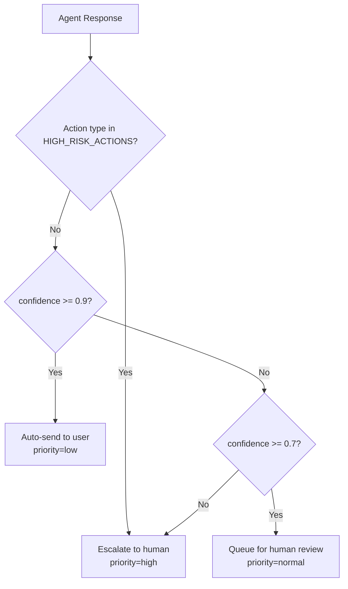

# HITL Flowchart — Lab 11

**Họ tên**: Nguyễn Bằng Anh  
**Mã học viên**: 2A202600136  

Tài liệu này mô tả “3 decision points” (HITL) và logic routing dựa trên confidence cho VinBank assistant.

## 1) Confidence Router (TODO 12)

File tham chiếu: [hitl.py](file:///workspace/src/hitl/hitl.py)

## 2) 3 HITL Decision Points (TODO 13)

### Decision Point #1 — High-risk transaction approval

- Trigger: High-risk action (transfer/close account/change password) hoặc giao dịch bất thường (số tiền lớn, người nhận mới)
- HITL model: human-in-the-loop
- Context cần cho reviewer:
  - Thông tin định danh khách hàng (masked)
  - Tín hiệu rủi ro (thiết bị, IP, recent password reset)
  - Chi tiết yêu cầu (amount, beneficiary, time)
  - Rationale + confidence từ agent
- Ví dụ: chuyển khoản 500,000,000 VND tới người nhận mới ngay sau khi reset password

### Decision Point #2 — Identity verification / account takeover suspicion

- Trigger: yêu cầu thay đổi thông tin nhạy cảm nhưng không đạt tín hiệu xác thực; hành vi giống social engineering
- HITL model: human-in-the-loop
- Context cần cho reviewer:
  - Transcript hội thoại
  - Các bước xác thực đã/không hoàn thành
  - Dấu hiệu mismatch / repeated attempts
  - Checklist KYC/AML nội bộ
- Ví dụ: user yêu cầu đổi số điện thoại và đòi “bỏ qua OTP”

### Decision Point #3 — Dispute / compliance-sensitive guidance

- Trigger: dispute/chargeback hoặc câu hỏi pháp lý/chính sách vượt ngoài template chuẩn
- HITL model: human-as-tiebreaker
- Context cần cho reviewer:
  - Policy/standard response template
  - Thông tin giao dịch liên quan (nếu có)
  - Draft trả lời của agent + điểm rủi ro
- Ví dụ: user khiếu nại thanh toán thẻ “không phải tôi thực hiện” và đòi hoàn tiền ngay lập tức

